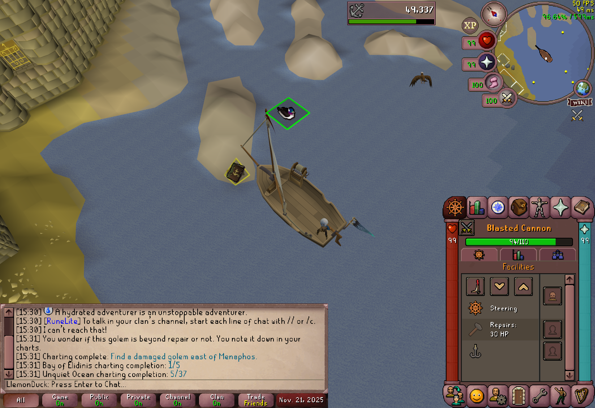
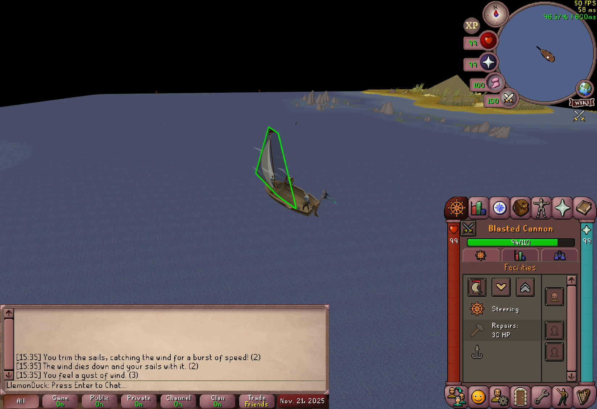
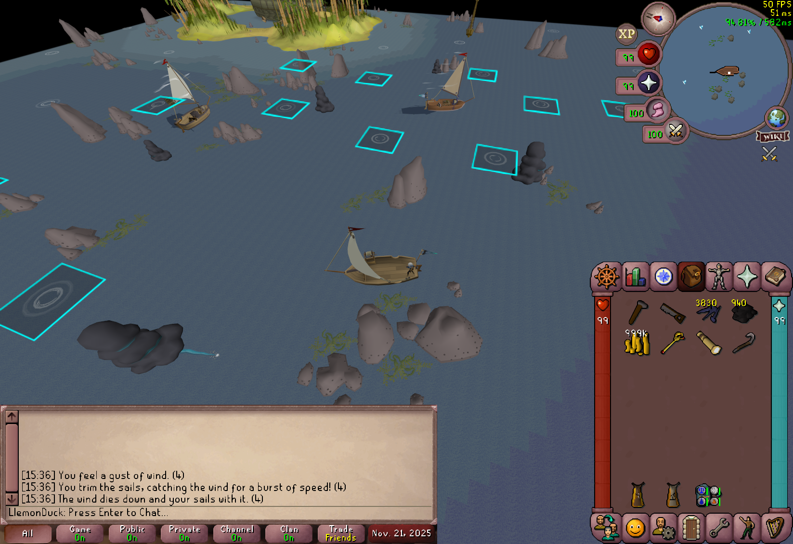

# Sailing

Take to the sea

### Sea Charting Highlighting

Highlights sea charting locations.
By default, only highlights uncharted locations in green.
Turn "Highlight Sea Charting Locations" to "All" 
to also show already-charted locations in yellow.

### Trimmable Sails Highlighting

Highlights your sails in green when they can be trimmed.

### Rapids Highlighting

Highlights nearby rapids.

TODO: Highlight with different colours depending on
whether your boat can withstand the rapids.

